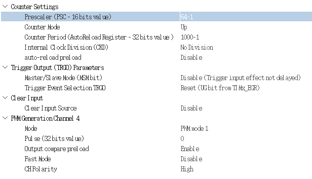

# GPIO 控制


### 使用 Grove 方式控制 GPIO

1、在编译之前，需要下载对应版本的内核头文件。

```shell
sudo apt update
sudo apt install linux-headers-$(uname -r) -y
```

注意：这一步可能需要开启代理才能完成！

2、下载 seeed-linux-dtoverlays 仓库，编译并安装 stm32p1 驱动。

```shell
git clone https://github.com/Seeed-Studio/seeed-linux-dtoverlays
```

编译、安装

```shell
cd seeed-linux-dtoverlays
make all_stm32mp1 CUSTOM_MOD_FILTER_OUT="jtsn-wm8960" && sudo make install_stm32mp1 CUSTOM_MOD_FILTER_OUT="jtsn-wm8960"
```

3、修改 /boot/uEnv.txt 文件，在该文件末尾添加下面几行。

```shell
uboot_overlay_addr1=/lib/firmware/stm32mp1-seeed-spi5-overlay.dtbo
uboot_overlay_addr2=/lib/firmware/stm32mp1-seeed-usart2-overlay.dtbo
uboot_overlay_addr3=/lib/firmware/stm32mp1-seeed-i2c4-overlay.dtbo
```

重启系统

```shell
sudo reboot
```

4、安装 Python3 环境

```shell
sudo apt install python3 python3-pip -y
```

5、安装 Grove.py

```shell
sudo pip3 install Seeed-grove.py
```

下载 grove.py 库源代码

```shell
git clone https://github.com/Seeed-Studio/grove.py
```

运行示例

```shell
cd grove.py/grove
sudo python3 grove_gpio.py 5
```


### 使用 sysfs 方式控制 GPIO

```shell
sudo gpioinfo
```


### 其他方案

- WiringPi
- Libgpiod
- Adafruit-PureIO


### Libgpiod

固件已经安装了 libgpiod 库，所以可以看到系统中有一些 gpio 命令

- gpiodetect
- gpiofind
- gpioget
- gpioinfo
- gpiomon
- gpioset


```shell
# gpioinfo 
gpiochip0 - 16 lines:
        line   0:      unnamed       unused   input  active-high 
        line   1:      unnamed       unused   input  active-high 
        line   2:      unnamed       unused   input  active-high 
        line   3:      unnamed       unused   input  active-high 
        line   4:      unnamed       unused   input  active-high 
        line   5:      unnamed       unused   input  active-high 
        line   6:      unnamed       unused   input  active-high 
        line   7:      unnamed       unused   input  active-high 
        line   8:      unnamed       unused   input  active-high 
        line   9:      unnamed       unused   input  active-high 
        line  10:      unnamed       unused   input  active-high 
        line  11:      unnamed       unused   input  active-high 
        line  12:      unnamed       unused   input  active-high 
        line  13:      unnamed       unused   input  active-high 
        line  14:      unnamed       unused   input  active-high 
        line  15:      unnamed       unused   input  active-high
```

设置 GPIO_A3 管脚电平

```shell
gpioset gpiochip0 3=1
gpioset gpiochip0 3=0
```


## 通过 M4 控制

### 闪烁灯 Demo

通过 STM32CubeIDE 配置 PA14 为 output 模式，在 main 函数的 while(1) 循环里添加如下代码。

```c
int main(void)
{
    /* Reset of all peripherals, Initializes the Flash interface and the Systick. */
    HAL_Init();

    if(IS_ENGINEERING_BOOT_MODE())
    {
        /* Configure the system clock */
        SystemClock_Config();
    }

    /* Initialize all configured peripherals */
    MX_GPIO_Init();
    MX_TIM2_Init();

    /* USER CODE BEGIN WHILE */
    while (1)
    {
	    HAL_GPIO_WritePin(LED_GPIO_Port, LED_Pin, GPIO_PIN_SET);
	    HAL_Delay(500);
	    HAL_GPIO_WritePin(LED_GPIO_Port, LED_Pin, GPIO_PIN_RESET);
	    HAL_Delay(500);
    }
}
```

### 呼吸灯 Demo

配置 PA3 为 TIM2_CH4 模式，配置 Timer2，使能 Channel 4，如下图所示。


接着配置 TIM2 参数。由于 Timer 的频率为 64 MHz，因此预分频系数设置为 64-1，自动重载值设置为 1000-1。所以 PWM 频率为 64,000,000 / 64 / 1000 = 1000 Hz。



因此，我们在一个周期内（比如 1ms）调节 PWM 的占空比（dutyCycle）即可实现呼吸灯效果，代码如下。

```c
int main(void)
{
    /* USER CODE BEGIN 1 */
	uint16_t dutyCycle = 0;
    /* USER CODE END 1 */
    
    /* Reset of all peripherals, Initializes the Flash interface and the Systick. */
    HAL_Init();

    if(IS_ENGINEERING_BOOT_MODE())
    {
        /* Configure the system clock */
        SystemClock_Config();
    }

    /* Initialize all configured peripherals */
    MX_GPIO_Init();
    MX_TIM2_Init();
    
    /* USER CODE BEGIN 2 */
    HAL_TIM_PWM_Start(&htim2,TIM_CHANNEL_4);
    /* USER CODE END 2 */

    /* USER CODE BEGIN WHILE */
    while (1)
    {
	    while (dutyCycle < 1000)
	    {
		    dutyCycle++;
		    __HAL_TIM_SET_COMPARE(&htim2, TIM_CHANNEL_4, dutyCycle);
		    //TIM3->CCR2 = dutyCycle;
		    HAL_Delay(1);
	    }
	    HAL_Delay(200);

	    while (dutyCycle > 10)
	    {
		    dutyCycle--;
		    __HAL_TIM_SET_COMPARE(&htim2, TIM_CHANNEL_4, dutyCycle);
		    //TIM3->CCR2 = dutyCycle;
		    HAL_Delay(1);
	    }
	    HAL_Delay(400);
    }
}
```

### 启动 M4 程序

```shell
cp led_CM4.elf /lib/firmware/
echo led_CM4.elf > /sys/class/remoteproc/remoteproc0/firmware
chmod 777 /sys/class/remoteproc/remoteproc0/firmware
echo start > /sys/class/remoteproc/remoteproc0/state
echo stop > /sys/class/remoteproc/remoteproc0/state
```

