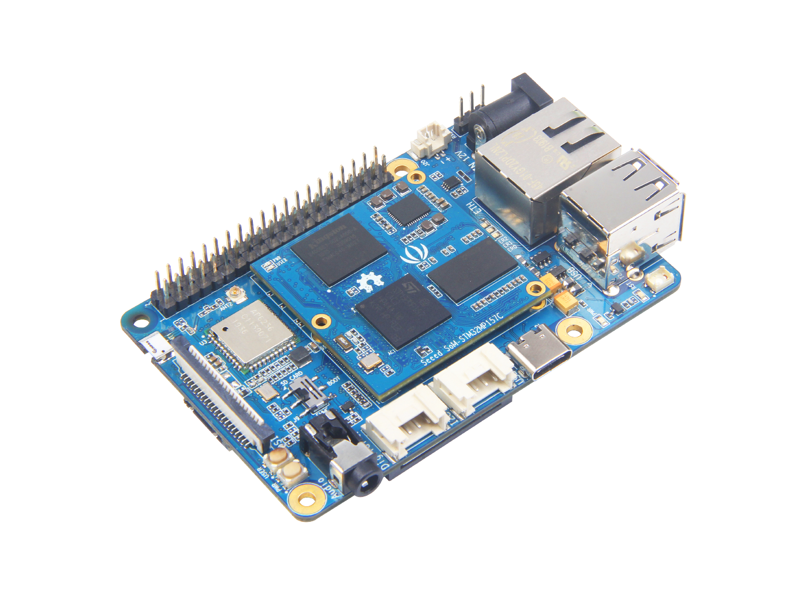
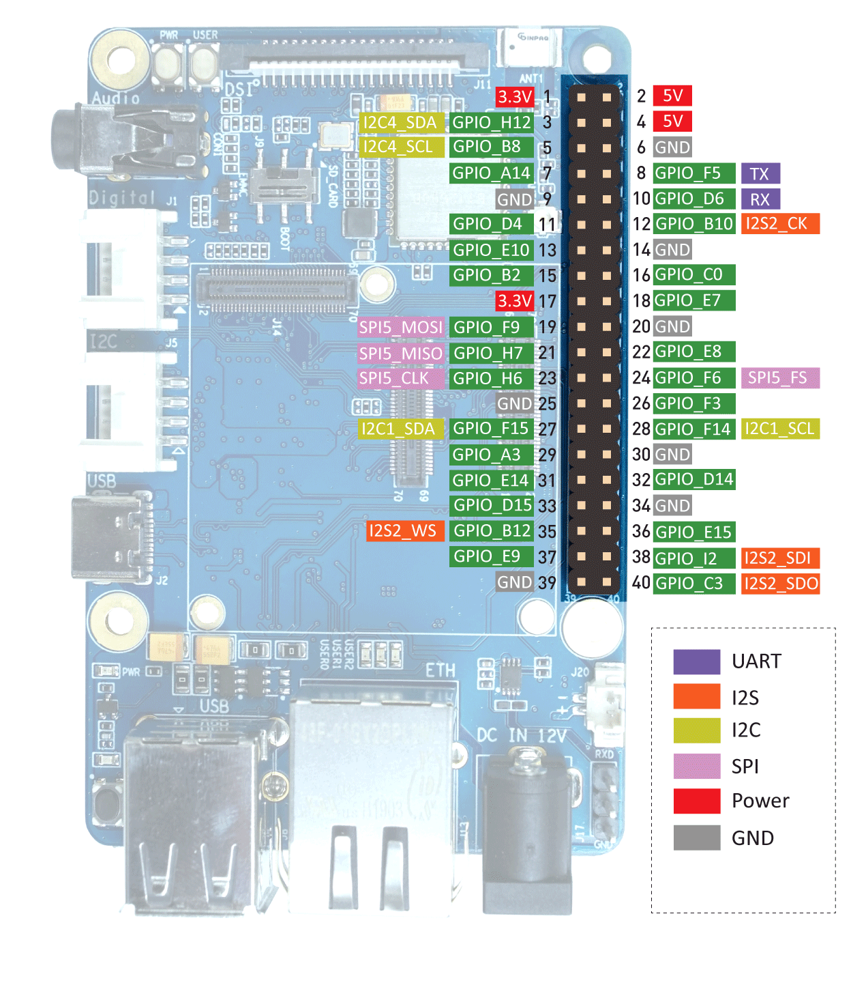

# ODYSSEY – STM32MP157C 介绍

ODYSSEY – STM32MP157C 以模块上系统（SoM）和载板的形式创建。SoM 由 MPU，PMIC，RAM 组成，并且载板采用 Raspberry Pi 尺寸。载板上包括所有必需的外围设备，包括千兆以太网、WiFi / BLE、直流电源、USB 主机、USB-C、MIPI-DSI、摄像机、音频的 DVP 等。使用该板，客户可以快速评估 SoM，并轻松快捷地将 SoM 部署在自己的载板上。

## 规格参数

### 核心板SoM – STM32MP157C

- MPU: STM32MP157C
    - 32位双核 Arm Cortex-A7
    - 32位具有 FPU/MPU的单核Arm Cortex-M4
- PMU: ST PMIC STPMIC1A
- RAM: 512MB DDR3 RAM
- Flash: 4GB EMMC
- 外围接口: 3 路70针 板对板连接器
- 尺寸：38mm x38mm

### 载板

- 外围接口：
    - 2 路 USB 主机端口
    - 1 路千兆以太网口
    - 1 路3.5mm 音频接口
    - 1 路 MIPI DSI 显示接口
    - 1 路 DVP 摄像头接口
    - 2 路Grove (GPIO & I2C)接口
    - 1 路 SD卡接口(背面)
- WiFi/蓝牙
    - WiFi 802.11 b/g/n 2.4GHz
    - 蓝牙 4.1
- LED
    - 1 个复位LED
    - 3 个用户LED
    - 1 个电源LED
- 电源
    - 1 个DC接口
    - 1 个USB Type-C接口
- 按键开关
    - 1 个复位按键
    - 1 个用户按键
    - 1 个拨码开关

## 资源分布

### 板载资源

1. 载板：安装核心板 SoM-STM32MP157C的区域。
2. 直流电源输入端口：12V〜24V / 2A（建议输入12V / 2A电源）。
3. ETH接口：网络电缆接口可以连接到千兆级网络。
4. USB端口：两个USB主机端口
5. USB设备：USB 2.0 TypeC。如果将Type C用作板卡电源输入，则应使用5V / 3A电源适配器。
6. 数字Grove接口：将Grove接口连接到数字引脚。
7. IIC Grove接口： 将Grove接口连接到IIC引脚。
8. 音频接口： 3.5mm音频接口。
9. MIPI DSI接口：使用MIPI DSI接口（FPC 20Pin 1.0mm）连接到显示器。
10. 40 PIN GPIO接口：与Raspberry Pi的40-PIN兼容。
11. AP6236: 2.4G WiFi＆BT 4.2控制芯片
12. 滑动开关： 可用于选择SD卡或eMMC来启动。
13. 调试UART： 系统默认的调试串行端口
14. JST 1.0mm: 3VRTC电池接口。
15. RST键：系统复位键
16. PWR按键：长按约8秒可关闭，短按可启动。
17. 用户按钮：用户按钮。
18. PWR LED: 开发板电源指示灯。
19. User LED: 用户可编程的LED。
20. ACA-5036-A2-CC-S: 板载2.4G陶瓷天线。
21. IPEX 1代：外部2.4 G外部天线座（使用外部天线时，需要卸下R49，R51两
    个0Ω电阻）
22. SD卡插槽：将装有系统的SD卡插入该区域
23. DVP摄像头接口：通过DVP接口（FPC 20Pin 1.0mm）连接到摄像机。
24. KSZ9031: 1000M网络电缆驱动器网卡。
25. STMPS2252MTR: 电源开关芯片。
26. MP9943: 降压DCDC电源芯片。
27. WM8960: 音频编解码器芯片。
28. MP2161: 降压DCDC电源芯片。

### 核心板资源

1. STM32MP157C: 核心板处理器(双架构处理器：Arm Cortex-A7 and Cortex-M4 )
2. MT41K256M16TW-107:P: 512M 16位RAM内存芯片
3. STPMIC1APQR: 电源管理芯片
4. EMMC04G-M627: 4GeMMC内存
5. LED: 成功供电后，PWR将继续工作。当系统正常运行时，USER LED将一直闪烁。
6. 70针连接器：3路70针板对板连接器

## 管脚定义

