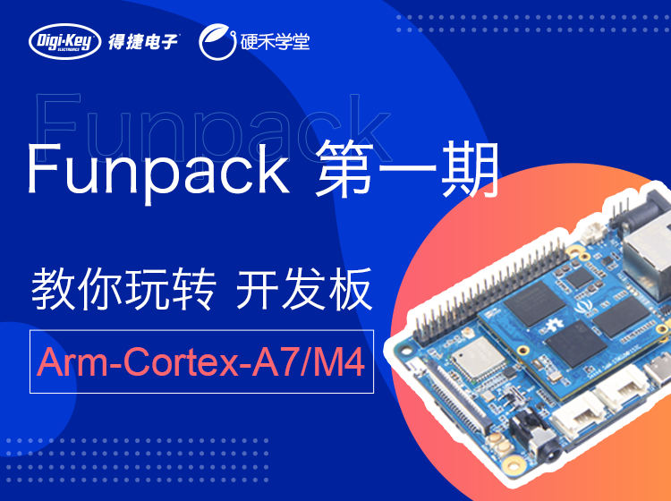
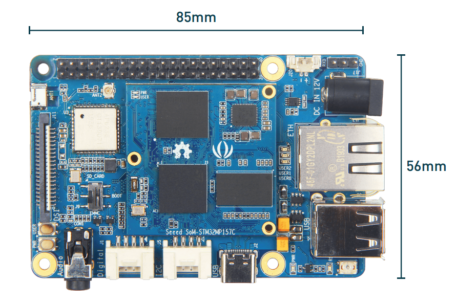
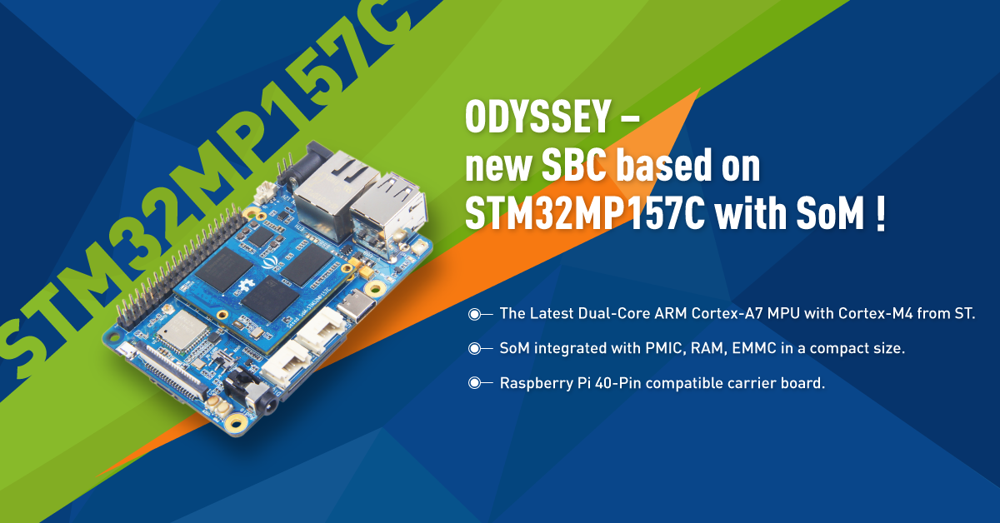
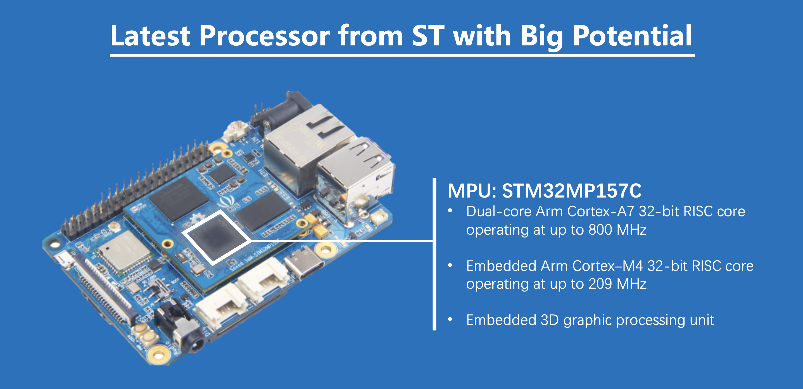
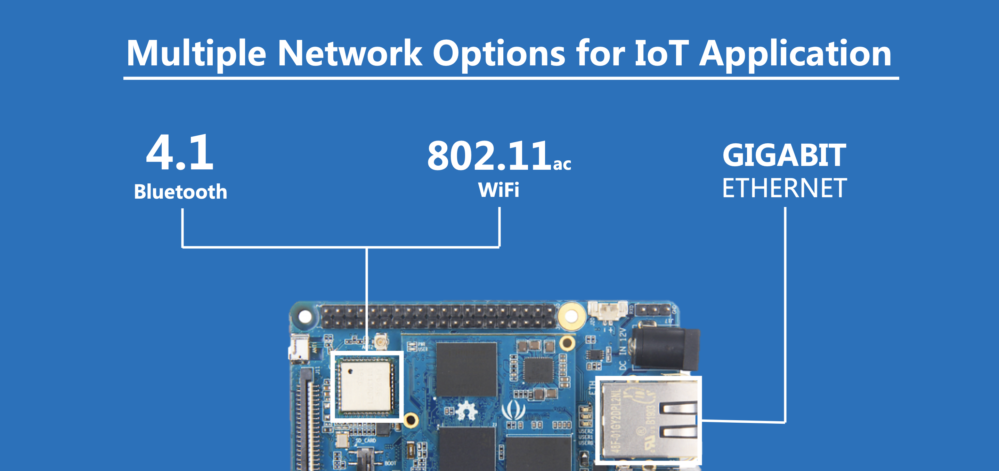
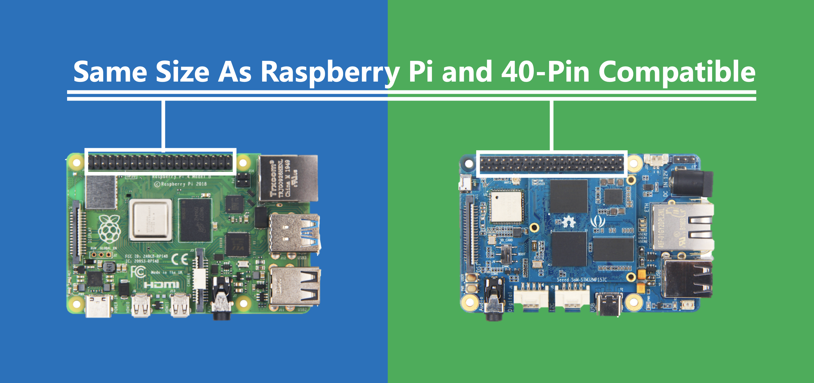
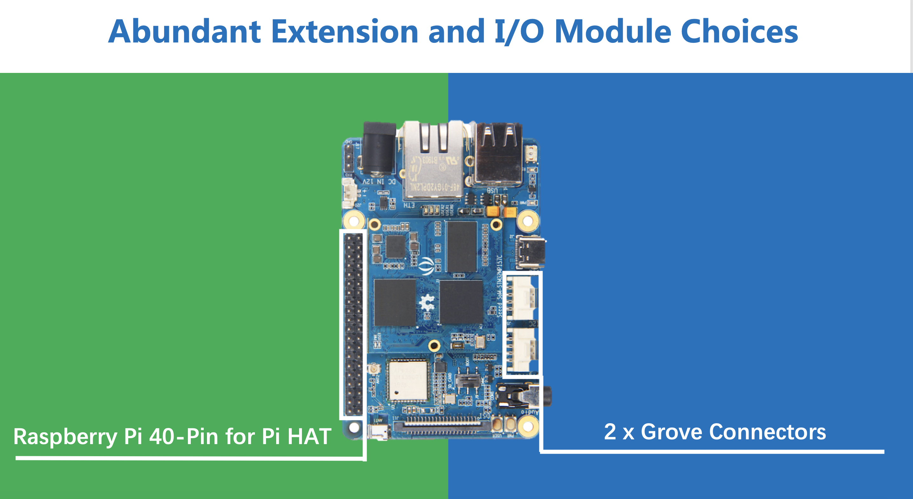
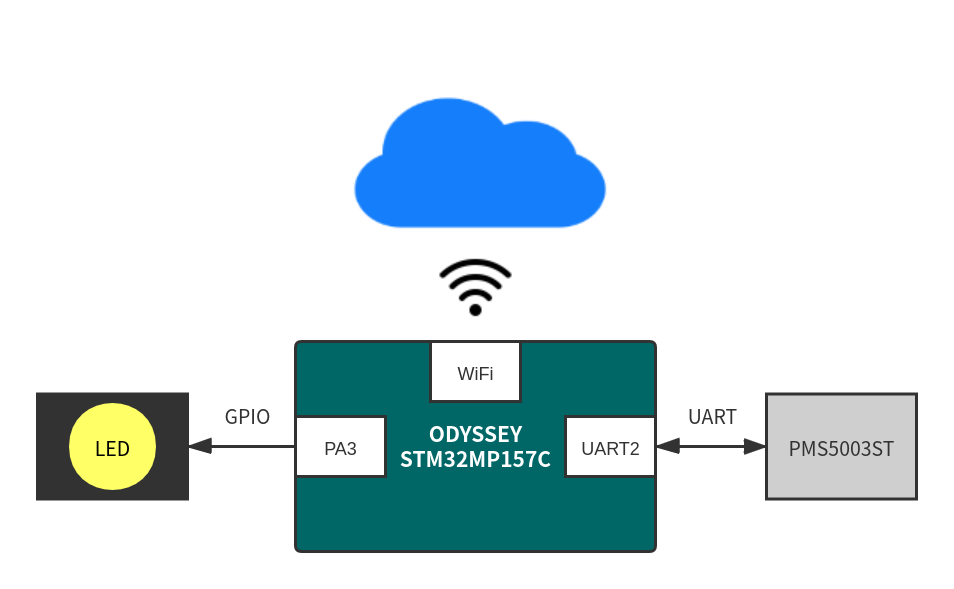

# 视频讲稿

3-5分钟短视频，包含：

- 自我介绍
- 硬件介绍（控制器及外设，应用方向及应用场景）
- 设计思路（用板子的哪些模块实现了什么功能）
- 指定功能演示：
    - 驱动LED灯亮，使其实现呼吸灯的效果；
    - 成功驱动SPI、I2C、UART三个外设中的其中一个，且在拍视频时显示出来。





> Hello，大家好！我是 Rudy。
>
> 这是得捷电子和硬禾学堂联合推出的 Funpack 第一期，这一期的主角是来自 Seeed Studio 的奥赛德 STM32MP157C 开发板。
>
> 本期视频主要分为三部分：
>
> 1. 介绍 ODYSSEY-STM32MP157C
> 2. 驱动 GPIO 实现呼吸灯
> 3. 驱动 UART 读取传感器


## 01 ODYSSEY-STM32MP157C

Seeed 的 ODYSSEY-STM32MP157C 是我个人非常喜欢的一款开发板，首先它的尺寸和树莓派一样，非常小巧。其次，它搭载了意法半导体的首款 MPU —— STM32MP157，拥有丰富的学习资源和生态。同时，它采用核心板 + 载板的设计，硬件设计完全开源，不仅适合学习，还可以用于产品开发。























## 02 实现 LED 呼吸灯


## 03 通过 UART 读取传感器数据


OK，我们已经正确读取到来自 PMS5003ST 传感器的数据。

前面我们说过，这个板子配备以太网、WiFi 和蓝牙功能，所以我们可以进一步把传感器数据上传到物联网云平台上。

此时，板上的 WiFi 功能已经打开，并且已经连接上我的局域网。

```shell
ifconfig wlan0
ping www.eetree.cn
```

我已经事先在阿里云物联网平台上创建了一个产品和设备，包含六个属性——PM1.0、PM2.5、PM10、甲醛浓度，以及温度和湿度，对应传感器中采集的数据。

设备端和云端通过三元组信息绑定，