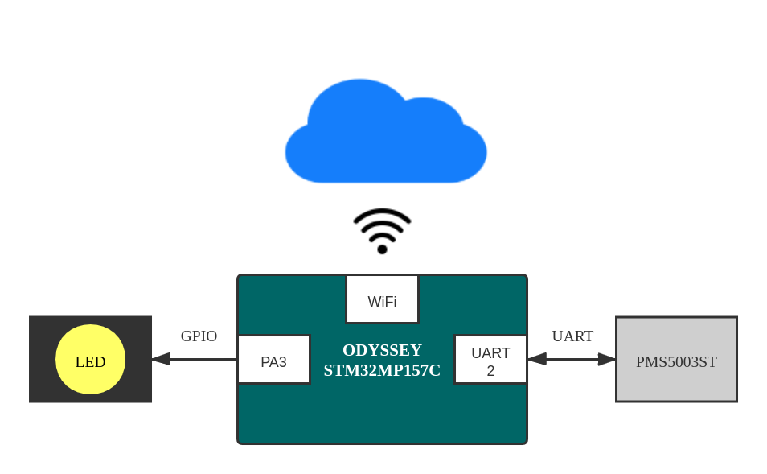

# 说明文档


## 自我介绍

大家好，我叫卢华东，英文名 Rudy，目前在广州工作。业余时间喜欢折腾一些开源软件和硬件，正在努力成为一名真正创客，利用开源和科技的力量做出能促进社会进步的产品。也正因如此，接触到硬禾学堂，参加了 Funpack 第一期活动。


## 实现功能

视频介绍：<https://www.bilibili.com/video/BV1Vy4y1C7DC/>

代码仓库：<https://github.com/luhuadong/ODYSSEY-STM32MP157C>



我在 ODYSSEY-STM32MP157C 开发板上主要实现了两个功能：

- 驱动 GPIO 实现呼吸灯效果；
- 驱动 UART 串口获取传感器数据，并将数据上报阿里云 IoT 平台。

针对这次活动和实现的功能，我一共整理了五篇文章：

1. [【ODYSSEY-STM32MP157C】硬件平台及学习资源](https://blog.csdn.net/lu_embedded/article/details/108772378)
2. [【ODYSSEY-STM32MP157C】环境搭建与系统运行](https://blog.csdn.net/lu_embedded/article/details/108799397)
3. [【ODYSSEY-STM32MP157C】驱动 GPIO 实现呼吸灯](https://blog.csdn.net/lu_embedded/article/details/108815555)
4. [【ODYSSEY-STM32MP157C】驱动 UART 读取传感器数据](https://blog.csdn.net/lu_embedded/article/details/108900941)
5. [【ODYSSEY-STM32MP157C】上报数据到阿里云 IoT 平台](https://blog.csdn.net/lu_embedded/article/details/108902096)

关于 Demo 的设计以及如何运行，均在文档中有详细描述。同时，这五篇文章我已经转成 PDF 格式，添加到附件中方便查阅。

所有代码均已放在我的 GitHub 仓库 <https://github.com/luhuadong/ODYSSEY-STM32MP157C> 中的 code 目录。目录结构如下：

```shell
code
├── iot-demo
│   └── device.py    # 阿里云IoT快速连接测试
├── led              # STM32CubeIDE生成的工程，用于生成M4实现呼吸灯的功能固件
├── led-shell        # Shell脚本控制LED
│   ├── blink.sh
│   └── breath.sh
└── uart             # 串口操作相关代码
    ├── c            
    └── python       
        ├── show_pms5003st.py     # 驱动串口并解析传感器数据
        └── upload_pms5003st.py   # 将传感器数据上报阿里云
```


## 心得体会

这是我第一次使用 STM32MP1 系列开发板，虽然 STM32MP1 已经发布一年多了，有官方的 WiKi 和许多第三方资料，但第一次上手使用异构多核处理器还是有点迷茫。好在电子森林收集了许多好的资料，同时有一个活跃的交流群，我也在一边学习一边开发过程中完成了任务。

我知道完成任务不等于停止学习，ODYSSEY-STM32MP157C 是一个不错的学习平台，还有许多东西等待我们去探索。包括核间通信、在 M4 运行 RTOS、构建一个 Linux SDK 等等，将是我接下来进一步学习的内容，我也会继续将我学到的东西分享给大家。

最后，再次感谢得捷电子和硬禾学堂，感谢 Funpack 第一期的各位小伙伴！


​                                                                                                                                                                2020年10月2日